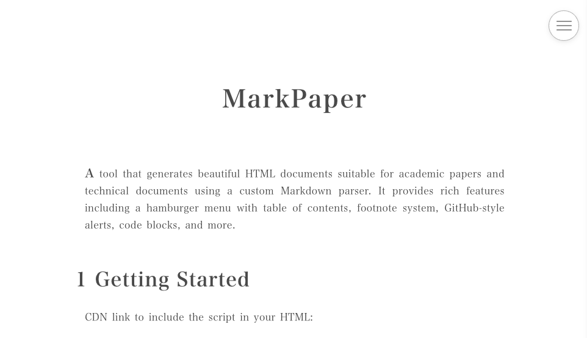

# MarkPaper

To create beautiful documents, all you need is to write Markdown text. MarkPaper is a tool that generates beautiful HTML documents suitable for academic papers and technical documents using a custom Markdown parser. It provides rich features including a hamburger menu with table of contents, footnote system, GitHub-style alerts, code blocks, and more.

## Demo
You can see the demo of MarkPaper at [MarkPaper Demo](https://tetsuakibaba.github.io/MarkPaper/?file=sample.md).

## Getting Started

### 1. Include the CSS and JavaScript files in your HTML:
```html
<!DOCTYPE html>
<html lang="ja">
<head>
    <meta charset="UTF-8">
    <meta name="viewport" content="width=device-width, initial-scale=1, shrink-to-fit=no">
    <title>MarkPaper</title>
    <link rel="stylesheet" href="https://cdn.jsdelivr.net/gh/TetsuakiBaba/MarkPaper/markpaper.css">
</head>
<body>
    <button id="hamburger-btn" class="hamburger-btn" aria-label="Open Menu">
        <span></span>
        <span></span>
        <span></span>
    </button>
    <nav id="side-menu" class="side-menu">
        <div class="side-menu-header">
            <h3>Menu</h3>
        </div>
        <ul id="table-of-contents" class="table-of-contents">
        </ul>
    </nav>
    <article id="content">Loading...</article>
    <script src="https://cdn.jsdelivr.net/gh/TetsuakiBaba/MarkPaper/markpaper.js" crossorigin="anonymous"
        type="text/javascript"></script>
</body>

</html>
```
### 2. Load your Markdown content
Open the index.html file with a file parameter such as `file=your_markdown_file` to load the Markdown content. For example, you can use `file=index.md` in the URL to load the `index.md` file.

### CDNs
CDN link to include the script in your HTML:
```
<link rel="stylesheet" href="https://cdn.jsdelivr.net/gh/TetsuakiBaba/MarkPaper/markpaper.css">
```
```
<script src="https://cdn.jsdelivr.net/gh/TetsuakiBaba/MarkPaper/markpaper.js" crossorigin="anonymous" type="text/javascript"></script>
```


## Features

- **Responsive Design**: Supports mobile to desktop devices
- **Hamburger Menu**: Access table of contents from the circular menu in the top right
- **Auto Table of Contents Generation**: Automatically generates TOC from h2 headings
- **Extended Markdown Syntax**: Rich syntax support including footnotes, alerts, code blocks
- **Beautiful Typography**: Font settings optimized for Japanese text

## Supported Markdown Syntax

### Basic Syntax

#### Headings
```markdown
# h1 heading
## h2 heading (numbered, displayed in TOC)
### h3 heading (numbered)
#### h4 heading
##### h5 heading
```

#### Text Decoration
```markdown
**Bold text**
*Italic text*
```

#### Lists
```markdown
- Unordered list item 1
- Unordered list item 2

* Ordered list item 1
* Ordered list item 2
```

### Extended Syntax

#### Footnotes
```markdown
This is text with a footnote[^1].

[^1]: This is the footnote content.
```

**Features:**
- Footnotes are automatically placed at the end of the corresponding heading section
- Properly managed between sections
- Displayed as clickable links

#### Text Links
```markdown
[Link text](https://example.com)
```

**Features:**
- Opens in new tab with `target="_blank"`
- Security support with `rel="noopener noreferrer"`

#### Auto URL Linking
```markdown
https://example.com
```

**Features:**
- Supports HTTPS, HTTP, and FTP protocols
- No duplicate processing for URLs within existing links

#### Image Display
```markdown


```

**Features:**
- Automatic figure numbering when caption is specified (Figure 1, Figure 2...)
- Normal image display when no caption
- Responsive design (auto-resize according to screen width)
- Center-aligned display with rounded corners and borders

**Example:**
```markdown

```

**Result: Below is an example of actually displayed image.**


#### GitHub-style Alerts
```markdown
> [!NOTE]
> This is an information note.
> Can be written in multiple lines.

> [!WARNING]
> This is a warning message.

> [!IMPORTANT]
> This is important information.

> [!TIP]
> This is a helpful tip.

> [!CAUTION]
> This requires caution.
```

**Features:**
- 5 types of alerts (NOTE, WARNING, IMPORTANT, TIP, CAUTION)
- Color coding and icons according to each type
- Multi-line content support

#### Code Blocks

##### Inline Code
```markdown
This is an example of `inline code`.
```

Result: This is an example of `inline code`.

##### Fenced Code Blocks
````
```
function hello() {
  console.log("Hello World!");
}
```
````
Result:
```
function hello() {
  console.log("Hello World!");
}
```

**Features:**
- Horizontal scroll support
- Monospace font usage
- GitHub-like styling

#### Regular Blockquotes
```markdown
> This is a regular blockquote.
```
> This is a regular blockquote.

## Customization

### CSS Variables
You can customize colors and fonts in the `:root` section of `markpaper.css`:

```css
:root {
    --text-color: #4a4a4a;
    --background-color: #FFFFFF;
    --accent-color: #1d7484;
    --accent-hover-color: #982c61;
    --accent-visited-color: #144f5a;
    --border-color: #f1f1f1;
    --code-background: #f1f1f1;
    --blockquote-border: #1d7484;
}
```

### Font Settings
By default, it uses a serif font stack optimized for Japanese text, but it can be changed in the `body` CSS settings.

## Browser Support

- Chrome (recommended)
- Firefox
- Safari
- Edge

## File Structure

```
markpaper/
├── index.html          # Main HTML file
├── index.md            # Markdown content file
├── markpaper.js        # Custom Markdown parser
├── markpaper.css       # Main stylesheet
└── README.md          # This file
```

## License

MIT License

## Author

[TetsuakiBaba@github](https://github.com/TetsuakiBaba)

## Development Notes

This project aims to implement a simple and lightweight Markdown parser with elegant webpage display. It consists only of vanilla JavaScript and CSS without external library dependencies.

### Parser Features
- Memory-efficient streaming processing
- Section-based footnote management
- Robust error handling
- Extensible architecture

### Future Improvements
- [ ] Syntax highlighting feature
- [ ] Table syntax support
- [ ] Mathematical notation support
- [ ] Dark mode support
- [ ] Print style optimization
